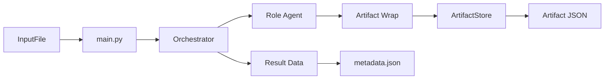

# Agentic Refactoring Plan (Spec2Code)

## Context

This repository is a multi-agent pipeline where agents run sequentially (YAML-driven), producing typed artifacts in `runs/<run_id>/`. The refactor evolves this into a **fully agentic architecture** with dynamic orchestration, auditability, and role-based control.

## Goals

- **Role-based workflow**: product -> requirements -> architecture -> implementation design -> review.
- **Human-in-the-loop (Product Owner only)**: all other roles operate on artifacts, never on the human.
- **Auditability**: every output is attributable to inputs, prompts, role policy, and prior artifacts.
- **Consistency**: automatic checks (deterministic + semantic) catch contradictions and gaps.
- **Reproducibility**: a run can be replayed or resumed from saved state.
- **Log separation**: operational logs (stderr, content-free) vs collaboration artifacts (business artifacts, full content).

## Non-Goals

- Not a project-management system, IDE plugin, or "single perfect spec generator."
- The design assumes iteration, uncertainty, and controlled amendments.

## Resolved Decisions

These decisions were made and implemented:

- **Schema technology**: JSON Schema is the canonical contract (exported, checked in). Pydantic models are the internal Python implementation. Both are generated from `agentic/artifacts/models.py` via `scripts/export_schemas.py`.
- **Stable ID format**: prefix-based, fixed-width counters (`REQ-0001`, `ADR-0001`, `ASM-0001`, etc.). Revisions keep the same ID; splits/merges record the relationship explicitly.
- **Collaboration artifacts**: stakeholder interaction content is stored as separate plain files under `runs/<run_id>/collaboration/`, referenced by path + content hash. No encryption for now.
- **Operational logs**: stderr JSON, content-free (IDs/hashes/counts only). No redaction needed because no business content enters operational logs.
- **Architecture notation**: C4-PlantUML exclusively.
- **Timestamps**: RFC 3339 / ISO 8601 with timezone offset (UTC by default).
- **No backward compatibility**: the "pipeline mode" is replaced; the supported product is the agentic orchestrator.

## Core Roles

| Role | Output artifacts |
|---|---|
| Product Owner (PO) | `ProblemBrief` |
| Business Analyst (BA) | `BusinessRequirements`, `NonFunctionalRequirements` |
| Solution Architect (SA) | `C4Model`, `ArchitectureDecisionRecordSet`, `TechStackRecommendation` |
| System Analyst (SysA) | `ImplementableSpec` |
| Developer | `ImplementationDesign`, `WorkBreakdown` |
| Senior Developer (Reviewer) | `DesignReview`, `CodeReview` |
| Security/Privacy Reviewer | `ThreatModel`, `PrivacyChecklist` |
| QA / Test Engineer | `TestPlan`, `AcceptanceTests` |

## Orchestrator Design

### Responsibilities

- Select next role(s); decide instance count (diversity/debate).
- Stop when information is insufficient (configurable confidence threshold).
- Request the Product Owner to obtain additional stakeholder input when needed.
- Enforce policies: budgets, per-role model selection, artifact schemas, audit gates.
- Record every decision and prompt revision as run artifacts.

### State Machine

`Intake` -> `Clarify` -> `Requirements` -> `Architecture` -> `ImplementableSpec` -> `ImplementationDesign` -> `Review` -> `Final`

Each transition is guarded by an audit gate.

### Information Sufficiency

After `Clarify` (and optionally later), the orchestrator produces an `InfoSufficiencyAssessment`:

- Coverage per required area, confidence score in [0, 1], blocking gaps.
- `MIN_CONFIDENCE_TO_PROCEED` is configurable.
- Deterministic checks must always pass; semantic checks drive proceed/revise/stop.

### Multi-Instance Patterns

- **Generate-and-critique**: one generator + one critic per artifact.
- **N-way alternatives**: 2-3 options, then select via rubric.
- **Debate then synthesize**: conflicting proposals resolved by the orchestrator.

## Artifact System

### Canonical Format

JSON with strict schema per type. Each artifact includes:

- **Identity**: `artifact_id`, `artifact_type`, `schema_version`
- **Provenance**: `run_id`, `created_at`, `created_by_role`, `inputs`, `model_config_ref`, `role_model_profile_id`, `prompt_ref`
- **Content**: typed fields (not freeform), with stable IDs cross-referenced across artifacts
- **Quality metadata**: assumptions, open questions, risks, acceptance criteria
- **Content hash**: SHA-256 of serialized content

### Artifact Store Layout

```text
runs/<run_id>/
  metadata.json
  artifacts/
    ProblemBrief.json
    BusinessRequirements.json
    ...
  collaboration/
    stakeholder_transcript.txt
    collaboration_events.jsonl
  audits/
    audit_results.json
```

## Auditing And Consistency

### Audit Gates

Before each state transition, the orchestrator runs:

- **Schema validation**: every artifact validates against its JSON Schema.
- **Traceability**: requirements trace to objectives; tasks trace to requirements.
- **Consistency**: no contradictory NFRs without explicit ADR trade-off.
- **Completeness**: no TBD in required sections; open questions deferred with impact.

### Audit Methods

- **Deterministic checks** (hard gate): schema, ID references, missing fields, duplicates.
- **Rubric-based semantic checks** (LLM-assisted): versioned rubric, evaluator cites evidence by artifact reference.

### Traceability Matrix

Generated `TraceabilityMatrix` artifact: rows = `REQ-*`, columns = `OBJ-*`, `ADR-*`, `DES-*`, `TASK-*`, `TEST-*`. Empty cells highlight gaps.

## Assumptions, Trade-Offs, And Amendments

- `AssumptionLedger`: stable IDs (`ASM-*`), status tracking, links to impacted `REQ-*` / `ADR-*`.
- `TradeoffRegister`: stable IDs (`TO-*`), options, rationale, "what would change our mind."
- `Amendment`: references `base_run_id` + amended items; triggers a derived run that recomputes dependent artifacts with new hashes and provenance.

## Data Modeling And Performance Requirements

### 3NF

Persistent data models must be at least 3NF. Deliberate denormalization requires an ADR + correctness strategy + performance justification.

### Performance Guidance

For every critical flow, artifacts must include:

- Complexity expectations (Big-O).
- Indexing recommendations with rationale.
- Cardinality and growth assumptions (linked to `AssumptionLedger`).
- Hot paths and mitigations.

## Target Package Layout

```text
./
  main.py
  agentic/
    orchestration/
      orchestrator.py             # State machine + policy engine
      policies.py                 # Role routing, budgets, spawn rules
    roles/                        # Per-role modules
    artifacts/
      models.py                   # Typed artifact models
      schemas/                    # JSON Schema files
      store.py                    # Artifact store
    audits/
      gates.py                    # Audit gates
      checks.py                   # Deterministic validators
      rubric_eval.py              # Semantic evaluator
    collaboration/
      event_log.py                # Collaboration event writer/reader
    runtime/
      agent_runner.py             # LLM invocation, retries
      prompt_registry.py          # Prompt templates and revisions
  config/
    agentic.yaml                  # Role model profiles + orchestrator policy
    models/                       # Provider configs
```

## Migration Milestones

### Milestone 1: Canonical Artifacts, Schemas, And Role Model Profiles -- COMPLETED

Implemented:

- Artifact type registry (18 types) with Pydantic models and JSON Schema export.
- Artifact envelope (identity, provenance, quality metadata, content hash).
- `ArtifactStore` for run directory management and artifact persistence.
- Envelope validation (hard gate) and content validation (soft gate / warning).
- Per-role model profiles in `config/agentic.yaml` (GPT-5 series).
- Orchestrator wraps agent output in typed artifacts with provenance.
- Tests: `test_artifacts.py` covering models, store, validation, role profiles, and pipeline integration.



### Milestone 2: Collaboration Artifacts And Stakeholder Transcript -- COMPLETED

Implemented:

- `agentic/collaboration/` package with typed collaboration event models.
- `CollaborationEventLog` append-only JSONL writer/reader (`collaboration_events.jsonl`).
- `TranscriptStore` plain-file content store (`stakeholder_transcript.txt`) with SHA-256 content hashing.
- `ArtifactStore` run initialization now creates `collaboration/` directories.
- Orchestrator emits `orchestrator_decision_made` and `artifact_produced` events during runs.
- JSON Schema export now includes `CollaborationEvent.schema.json`.
- Tests: `test_collaboration.py` covers models, event log, transcript store, integration, and content-free logging checks.

Remaining scope for later milestones:

- Interactive Product Owner stakeholder Q/A loop and production use of `stakeholder_question_asked` / `stakeholder_answer_received`.

### Milestone 3: Semantic-Driven Audits, Confidence, And Stop Logic

Implement deterministic audits, `TraceabilityMatrix`, rubric-based semantic audits, and `InfoSufficiencyAssessment` with configurable confidence thresholds.

Exit criteria:

- The orchestrator stops when information is insufficient and can explain which additional stakeholder inputs are needed.

### Milestone 4: Assumptions/Trade-Offs Amendment Loop And Derived Runs

Add `AssumptionLedger`, `TradeoffRegister`, and `Amendment` artifacts. Support derived runs that rehash dependent artifacts after amendments.

Exit criteria:

- A formal amendment triggers a derived run that deterministically recomputes dependent artifacts.

### Milestone 5: Performance And Data Model Quality Gates (3NF + Indexing)

Add explicit audits for 3NF compliance and performance guidance. Ensure `ImplementationDesign` includes complexity analysis.

Exit criteria:

- Designs include explicit 3NF data structures and performance guidance; reviewers enforce them.

## Acceptance Criteria (Refactor Done)

- A single command produces: canonical typed artifacts per role, collaboration artifacts, audit results.
- The orchestrator routes dynamically, records every decision, can resume partial runs.
- Schema validation passes; traceability matrix has no critical gaps; reviews cite evidence.
